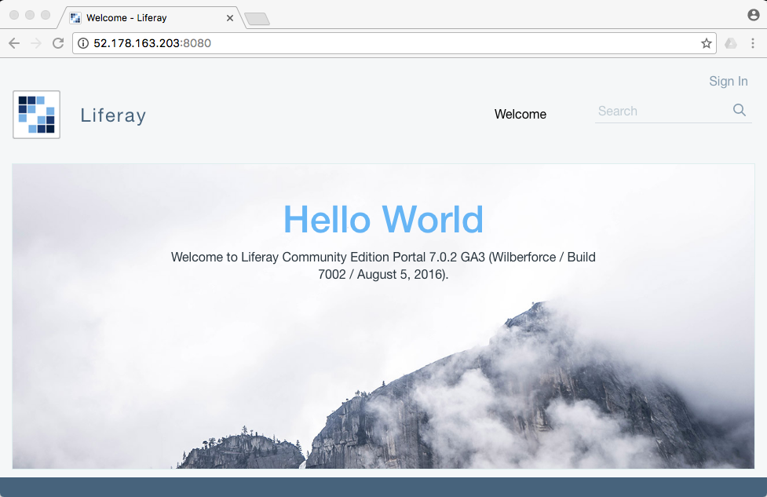
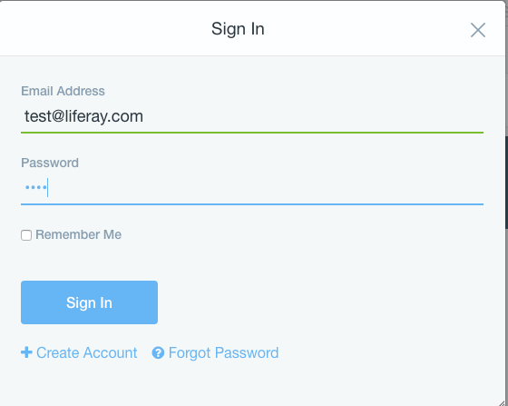

# 3. Liferay installation

Download Liferey 7.0 with installation with tomcat boundle for example you can use wget tool

wget [https://sourceforge.net/projects/lportal/files/Liferay%20Portal/7.0.2%20GA3/liferay-ce-portal-tomcat-7.0-ga3-20160804222206210.zip](https://sourceforge.net/projects/lportal/files/Liferay%20Portal/7.0.2%20GA3/liferay-ce-portal-tomcat-7.0-ga3-20160804222206210.zip)

after download you can see zip in your current folder, type

`ls`

to see zipped file

`liferay-ce-portal-tomcat-7.0-ga3-20160804222206210.zip`

Install unzip tool

`sudo apt install unzip`

and unzip zip file

`unzip liferay-ce-portal-tomcat-7.0-ga3-20160804222206210.zip`

After uncompressing zip file you can enter liferay home folder

cd liferay-ce-portal-7.0-ga3

Create **portal-ext.properties** in liferey home folder

`nano portal-ext.properties`

add portal settings lines and ajust boleded text to your specific situation

`admin.email.from.address=foo@bar.com`

`admin.email.from.name=Foo Admin`

`jdbc.default.driverClassName=com.mysql.jdbc.Driver`

`jdbc.default.password=ThiSISPassword.`

`jdbc.default.url=jdbc:mysql://localhost/lportal?characterEncoding=UTF-8&dontTra$`

`jdbc.default.username=root`

`liferay.home=/home/myuser/liferay-ce-portal-7.0-ga3`

`setup.wizard.add.sample.data=on`

`setup.wizard.enabled=false`

`##`

`## Redirect`

`##`

`#`

`# Set this property to "ip" or "domain" for the redirect security method. If`

`# set to "domain", the portal will only redirect users to domains listed in`

`# the property "redirect.url.domain.allowed". If set to "ip", the portal`

`# will only redirect to domains whose IP address resolve to an IP address`

`# listed in the property "redirect.url.ip.allowed".`

`#`

`redirect.url.security.mode=domain`

`#redirect.url.security.mode=ip`

`#`

`# Input a list of comma delimited domains which the portal is allowed to`

`# redirect to. Input a blank list to allow any domain.`

`#`

`redirect.url.domains.allowed=`

`#`

`# Input a list of comma delimited IPs which the portal is allowed to`

`# redirect to. Input a blank list to allow any IP. SERVER_IP will be`

`# replaced with the IP of the host server.`

`#`

`redirect.url.ips.allowed=127.0.0.1,SERVER_IP`

Save it. This way you will say to liferay which database you are using and setup admin user.

Go to tomcat bin folder

`cd tomcat-8.0.32/bin`

Default installation of Liferay is setup for use 1G memory. Typical sever has much more so if you want to really us it edit the memory serttings before you start the Liferay server. You can edit the **setenv.sh** file

`nano setenv.sh`

and modify Xmx and MaxPermSize parameters for example

... -Xmx2048m -XX:MaxPermSize=512m"

Save it and start the server

`sudo ./startup.sh`

You can see how server is starting in log file, type

`tail -f ../logs/catalina.out`

The server will take some time depends of your server performace \(30..2 min\) and at the end you will see some like

`...`

`Server startup in 177357 ms`

You can enter ip adres in your browser to validate server installation. It will use port 8080 by default so you need to enter like

[http://yourServerIPAdress:8080/](http://yourServerIPAdress:8080/)

You can start first login by using user **test@liferay.com** with password **test**

Accept Terms of use and change default password.

# Table of Contents

[1. Components installation](chapter1.md)

[2. MySQL installation](chapter2.md)

[3. Liferay installation](chapter3.md)

[4. Encrypting Tomcat Connections with Apache](chapter4.md)

